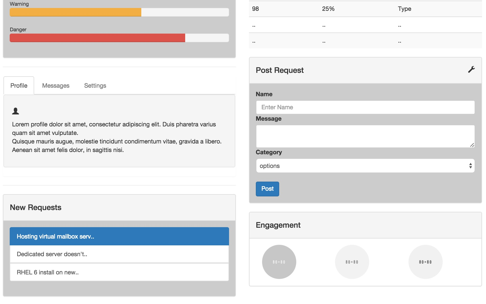
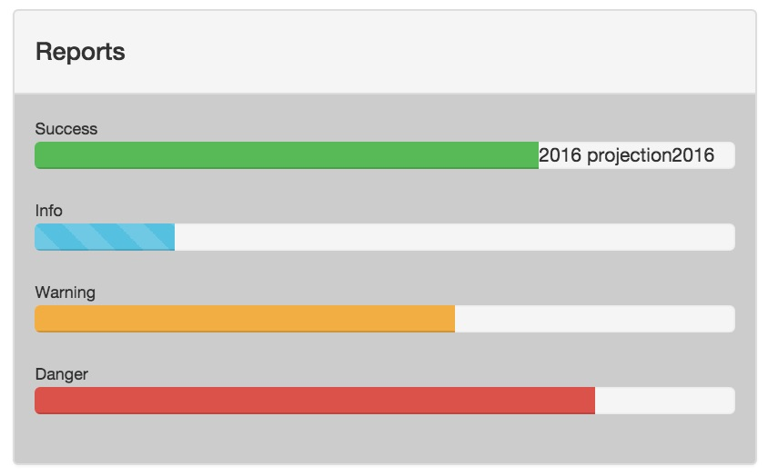
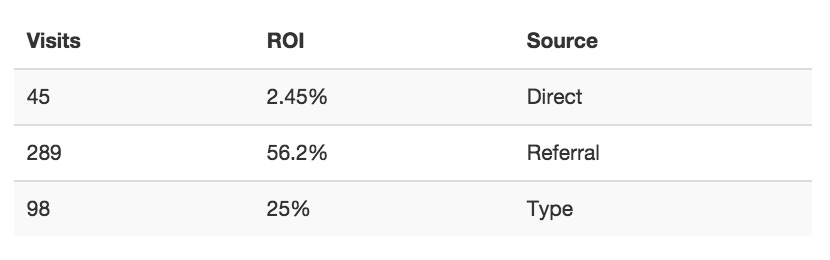
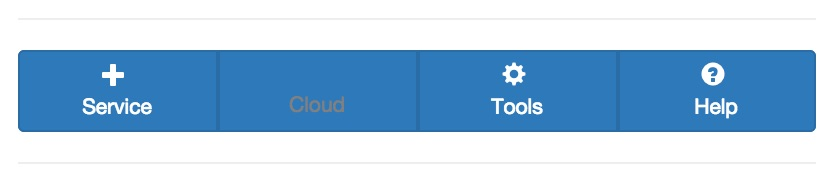
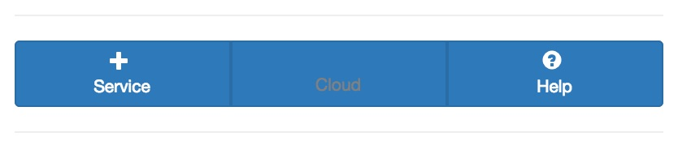
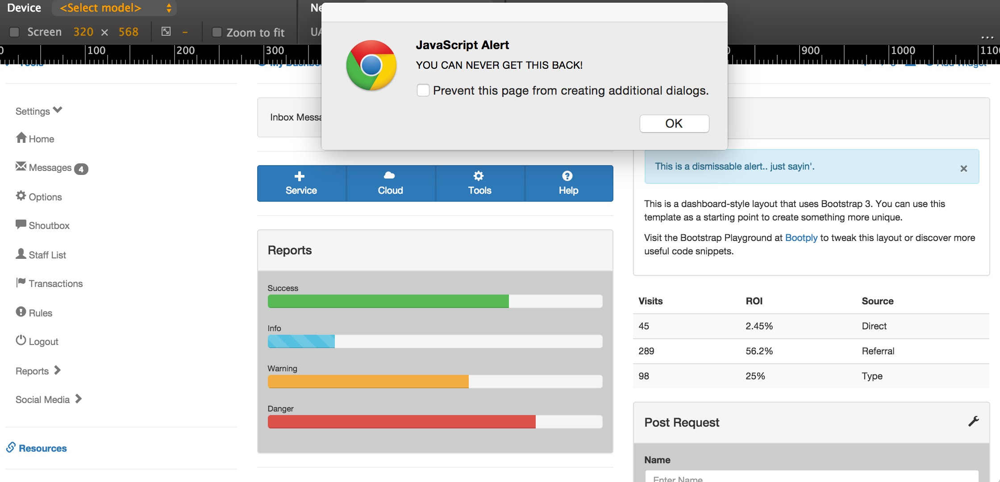
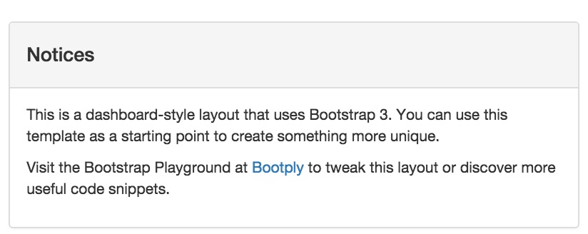
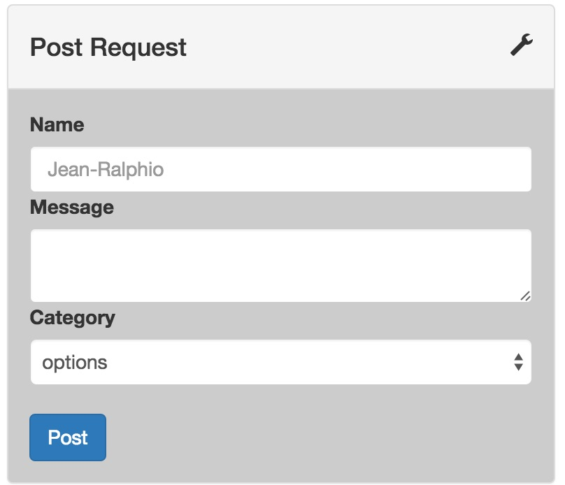

# Modifying an Existing, Complicated Project
- Bootstrap fun!
- Hook up all the parts!

## Set Up Instructions

**In the index.html file:** 
1. Insert the link to the application.css file. 
2. Insert the script for the jQuery CDN. 
3. Insert the script to link the main.js file. 

*Hint: take a look back on index.html files from previous weeks to see where/how these steps were done.*

## DO IT!
### First things first:###
*Check out how much prepackaged goodness you get with bootstrap by looking at the super small amount of code in the css file.* 
**You should not alter the html or css for any of the following tasks.**

1. When hovering over the new message count badge, the background color of the badge should change from dark grey to dark red (#b20000). 

2. For better contrast change the background color of every other panel to grey (#cccccc).

3. Create a span with the message "2016 projection" and set it to a variable called message.

4. Place the message in the Success bar in the Reports panel. It should only appear when the user hovers over the Success bar.   *nextAll could be useful here.*

5. In the table that contains Visits, ROI, and Source, delete the last two rows that contain no data.

6. When clicked, the individual buttons in the blue button group (Service, Cloud, Tools, and Help) should lose their icon and the text should turn grey.   *.find() is helpful here.*

7. The same buttons should disappear when they are double clicked.

8. In the dismissable alert in the Notices table, when a user clicks on the X, they should be alerted that they're removing the message. Then remove the entire light blue box.

9. When a user first comes to the page, prompt them for their name.

10. Use the input from the prompt to change the Name placeholder in the Post Request form.

